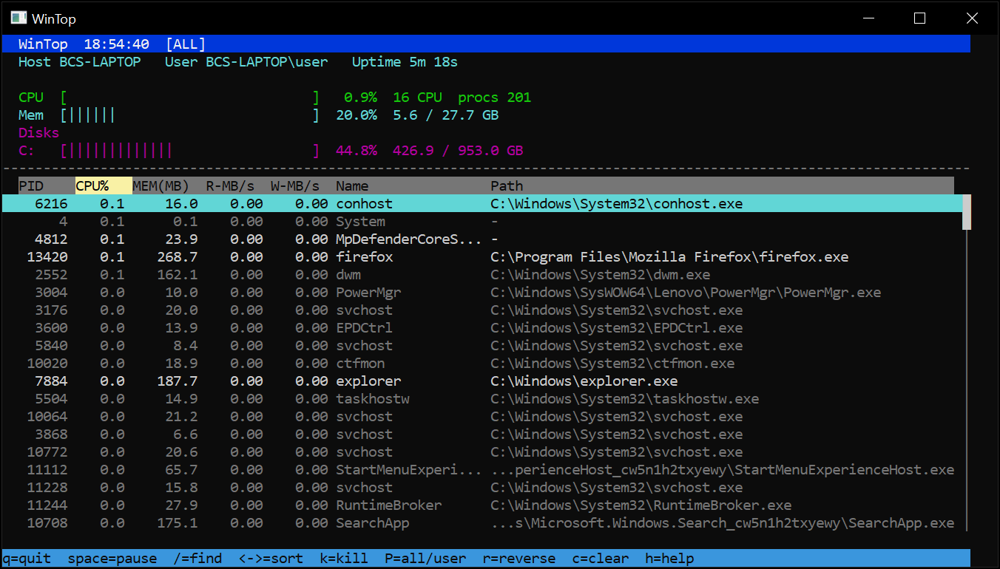

# WinTop

**WinTop** is a lightweight, interactive terminal process monitor and resource dashboard for Windows, inspired by `top` and `htop`. Built in C# (.NET 8) and distributed with a zero-dependency, automated PowerShell bootstrapper, it compiles into a self-contained, single-file native executable (`win-x64`) that runs on any modern Windows system without requiring pre-installed runtimes or administrative elevation.



---

## Features

- **System Resource Metrics:** Real-time visual meters for CPU utilization, physical memory usage, and fixed storage drive capacities.
- **Process Activity Tracking:** Live updates for PID, CPU%, Memory (Working Set MB), and per-process disk I/O Read/Write speeds (`MB/s`) via native Windows API hooks (`kernel32.dll`).
- **Interactive Navigation & Sorting:** Sort interactively by CPU, Memory, Read, Write, Name, or PID with bi-directional ordering.
- **Dynamic Search & Filtering:** Filter running tasks in real time by name, PID, or executable path with wildcard (`*`) matching support.
- **Safe Process Termination:** In-app process termination with critical system process guards to avoid accidental system destabilization.
- **Quick Command Runner:** Launch utilities and executables directly from the dashboard via a built-in run console.
- **Persistent Preferences:** Automatically saves display mode, active sort column, and direction to `%LOCALAPPDATA%\WinTop\settings.cfg`.
- **Zero Configuration Setup:** Includes an end-to-end bootstrapper script that provisions a user-local .NET 8 SDK (if missing), generates the source project, compiles, and publishes the self-contained binary.

---

## Keyboard Shortcuts

| Key | Action |
| :--- | :--- |
| `Up` / `Down` | Move process selection |
| `PageUp` / `PageDn` | Scroll process list by page |
| `Home` / `End` | Jump to top / bottom of process list |
| `Left` / `Right` | Cycle through sort columns (`PID`, `CPU%`, `MEM`, `R-MB/s`, `W-MB/s`, `Name`) |
| `s` / `F6` | Advance to next sort column |
| `r` | Reverse current sort direction (Ascending / Descending) |
| `/` or `F3` | Open live search/filter prompt (supports `*` wildcards) |
| `c` / `Esc` | Clear current search filter |
| `P` | Toggle between showing **All** processes and **User-only** processes |
| `Space` | Pause / resume background metric sampling |
| `k` / `F9` | Kill selected process (or batch terminate filtered results) |
| `Ctrl + R` | Open run dialog to execute a command or binary |
| `h` / `F1` | Show help overlay |
| `q` / `F10` | Exit WinTop |

---

## Quick Start (Automated Bootstrap)

The included PowerShell script handles disk space validation, user-local SDK management, project synthesis, single-file compilation, and automatic launch in a single step.

1. Open PowerShell (Windows PowerShell 5.1 or PowerShell 7+; administrative privileges are not required).
2. Run the bootstrapper script:

```powershell
.\Build-WinTop.ps1
